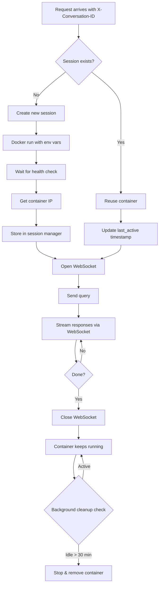

# Architecture Overview

AgCluster Container is designed as a lightweight, secure runtime for Claude Agent SDK instances.

## System Components

### 1. API Layer (FastAPI)

**Location:** `agcluster/api/`

The API layer provides:
- OpenAI-compatible `/chat/completions` endpoint
- SSE streaming support
- BYOK authentication
- Container lifecycle management

**Key Files:**
- `main.py` - FastAPI application
- `chat_completions.py` - OpenAI endpoint
- `agents.py` - Agent management (future)

### 2. Core Services

**Location:** `agcluster/core/`

#### Container Manager
- Creates/destroys Docker containers
- Manages resource limits
- Monitors container health
- Handles WebSocket communication

#### Session Manager
- Maps conversation IDs to persistent containers
- Manages container lifecycle per conversation
- Background cleanup of idle sessions (30 min timeout)
- Runs cleanup task every 5 minutes

#### Translator
- Converts OpenAI format ↔ Claude SDK messages
- Handles SSE streaming format
- Generates completion IDs

**Key Files:**
- `container_manager.py` - Docker lifecycle
- `session_manager.py` - Conversation-based sessions
- `translator.py` - Format translation
- `config.py` - Configuration

### 3. Agent Container

**Location:** `container/`

Each agent runs in an isolated Docker container:
- **Base Image:** Python 3.11-slim
- **SDK:** Claude Agent SDK
- **Server:** WebSocket server on port 8765
- **Workspace:** `/workspace` volume (writable)
- **Root FS:** Read-only for security

**Key Files:**
- `agent_server.py` - WebSocket server
- `Dockerfile.agent` - Container image

## Data Flow

### Request Flow

```
1. User sends message in LibreChat
   ↓
2. LibreChat → POST /chat/completions
   Headers: Authorization: Bearer ANTHROPIC_API_KEY
            X-Conversation-ID: {{conversationId}}
   Body: {model, messages, stream: true}
   ↓
3. AgCluster API receives request
   - Extracts API key and conversation ID from headers
   - Gets last user message
   ↓
4. Session Manager
   - Generates session ID from conversation ID
   - Checks if session exists for this conversation
   - If exists: Reuses container (context preserved!)
   - If new: Creates new container (docker run)
   - Waits for health check (new containers only)
   ↓
5. AgCluster → Container (WebSocket)
   Message: {type: "query", content: "..."}
   ↓
6. Agent Server (in container)
   - Uses persistent Claude SDK session
   - Processes query with tools (context maintained)
   - Streams responses back
   ↓
7. Container → AgCluster (WebSocket)
   Message: {type: "message", data: {...}}
   ↓
8. Translator
   - Converts to OpenAI SSE format
   - Generates chunk IDs
   ↓
9. AgCluster → LibreChat (SSE)
   data: {"choices":[{"delta":{"content":"..."}}]}
   ↓
10. LibreChat displays streaming text

Background: Cleanup task removes idle sessions after 30 min
```

### Container Lifecycle



## Security Model

### Container Isolation

Each agent container has:
- **Unique workspace volume** - Data isolation
- **User's API key** - No shared credentials
- **Resource limits** - CPU: 2 cores, Memory: 4GB
- **Minimal capabilities** - Dropped ALL, added only CHOWN/SETUID/SETGID
- **Read-only root** - Can't modify container internals
- **Network isolation** - Bridge network, no inter-container communication

### API Security

- **No credential storage** - API keys passed via Authorization header
- **Session-based containers** - Persistent per conversation, auto-cleanup after 30 min idle
- **No authentication** - Simple BYOK model (add auth in future)

### Docker Socket Access

The API container needs access to Docker socket (`/var/run/docker.sock`) to manage containers. This is a security consideration:
- **Development:** Acceptable for local use
- **Production:** Consider alternatives (Docker-in-Docker, Kubernetes)

## Scalability

### Current Limitations

- **Single host** - Docker SDK manages local daemon only
- **In-memory sessions** - Session state lost on API restart
- **No session persistence** - Cannot resume conversations after 30 min idle timeout

### Session Management (Implemented)

✅ **Conversation-based persistence**
   - One persistent container per conversation thread
   - Same Claude SDK session reused across all messages
   - Full context preservation within conversation
   - Auto-cleanup after 30 minutes idle
   - Background task runs every 5 minutes

### Future Improvements

1. **Session Persistence**
   - Store session state in Redis/PostgreSQL
   - Resume conversations after API restart
   - Configurable idle timeouts per user

2. **Multi-host**
   - Docker Swarm or Kubernetes
   - Distribute load across nodes
   - Handle thousands of concurrent conversations

3. **Advanced Session Management**
   - Session migration between hosts
   - Snapshot and restore workspace state
   - Share artifacts across sessions

## Configuration

### Environment Variables

| Variable | Default | Description |
|----------|---------|-------------|
| `API_HOST` | 0.0.0.0 | API bind address |
| `API_PORT` | 8000 | API port |
| `DOCKER_NETWORK` | bridge | Container network |
| `AGENT_IMAGE` | agcluster/agent:latest | Agent Docker image |
| `CONTAINER_CPU_QUOTA` | 200000 | CPU limit (2 cores) |
| `CONTAINER_MEMORY_LIMIT` | 4g | Memory limit |
| `DEFAULT_ALLOWED_TOOLS` | Bash,Read,Write,Grep | Default tools |

### Container Environment

Each container receives:
```bash
AGENT_ID=abc123
ANTHROPIC_API_KEY=sk-ant-...
SYSTEM_PROMPT="You are..."
ALLOWED_TOOLS=Bash,Read,Write
```

## Technology Stack

### Backend
- **FastAPI** - Web framework
- **Uvicorn** - ASGI server
- **Docker SDK** - Container management
- **WebSockets** - Agent communication
- **Pydantic** - Data validation

### Container
- **Python 3.11** - Runtime
- **Claude Agent SDK** - AI agent framework
- **WebSockets** - Communication protocol

### Infrastructure
- **Docker** - Containerization
- **Docker Compose** - Orchestration (dev)

## Error Handling

### Container Failures
- Timeout after 30s if container doesn't start
- Return error to client with details
- Clean up failed containers

### SDK Errors
- Caught in agent_server.py
- Sent as error messages via WebSocket
- Translated to OpenAI error format

### Network Errors
- WebSocket reconnection (not implemented yet)
- Graceful degradation
- Client-side retry recommended

## Monitoring

### Logs
- API logs: stdout (Docker logs)
- Container logs: Per-container stdout
- Access via `docker logs <container_name>`

### Metrics (Future)
- Container count
- Request latency
- Token usage
- Error rates

## Deployment Options

### Local Development
```bash
docker compose up
```

### Cloud (Docker)
- Deploy API container to cloud
- Requires Docker socket access
- Security considerations apply

### Cloud (Kubernetes) - Future
- Deploy as Kubernetes pods
- Use DaemonSets for agent containers
- Proper multi-tenant isolation

## Future Architecture

### Planned Features

1. **Agent Registry**
   - Store agent configurations
   - Template marketplace
   - Version control

2. **Multi-tenancy**
   - User authentication
   - Quota management
   - Billing integration

3. **Observability**
   - Prometheus metrics
   - Distributed tracing
   - APM integration

4. **Kubernetes Support**
   - Operator pattern
   - CRDs for agents
   - Auto-scaling
